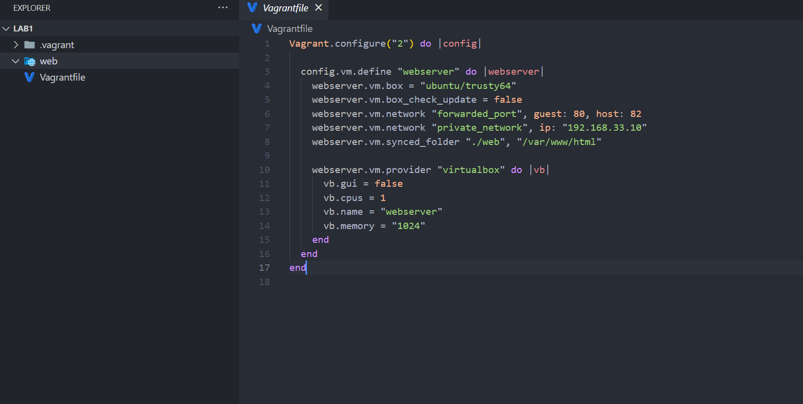

Rapport sur le Vagrantfile
1. Configuration de la Machine Virtuelle
Nom de la VM : webserver

Box utilisée : ubuntu/trusty64 (Ubuntu 14.04 LTS)

Mise à jour de la box désactivée : webserver.vm.box_check_update = false

2. Réseau
Port forwarding : Le port 80 de la machine virtuelle est redirigé vers le port 82 de l'hôte.

Réseau privé : La VM est configurée avec une adresse IP privée 192.168.33.10.

3. Synchronisation de Dossiers
Dossier synchronisé : Le dossier ./web sur la machine hôte est synchronisé avec /var/www/html sur la VM => permet de partager des fichiers entre l'hôte et la VM

4. Configuration du Fournisseur (VirtualBox)
Interface graphique désactivée : vb.gui = false

Nombre de CPU : 1

Nom de la VM dans VirtualBox : webserver

Mémoire allouée : 1024 MB
